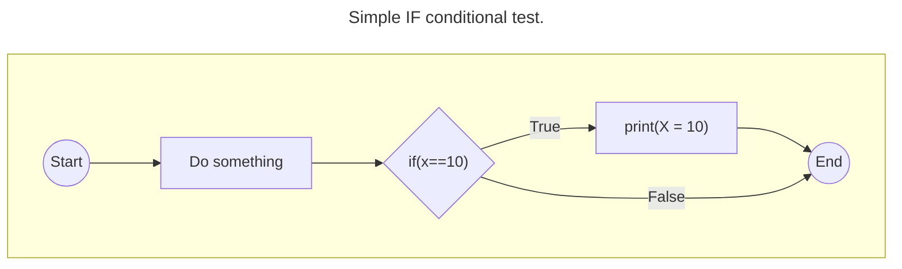
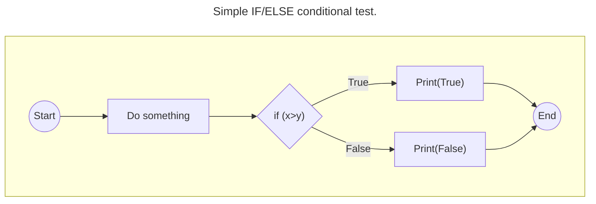
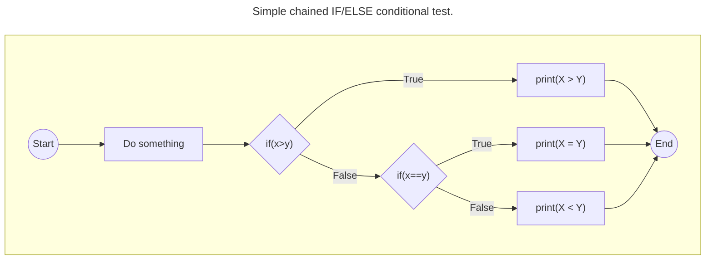
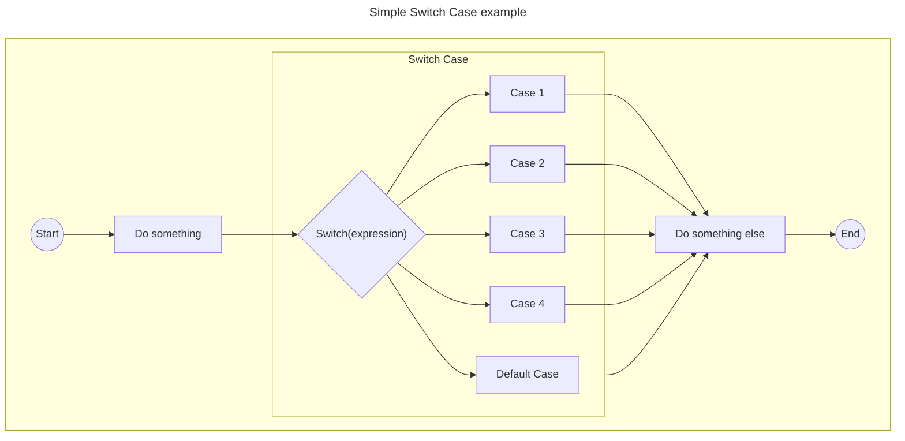
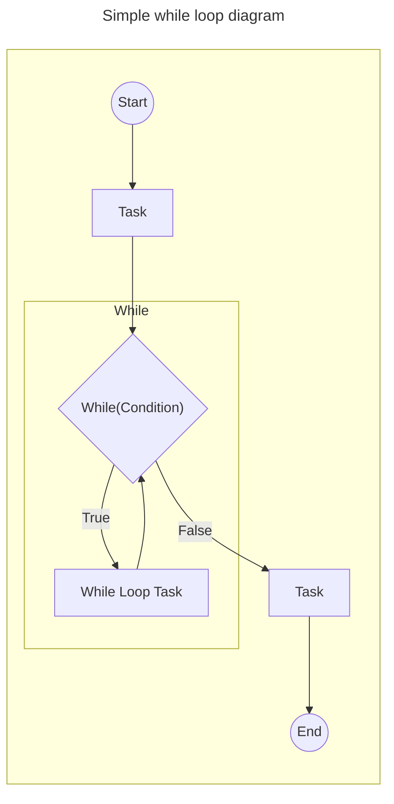
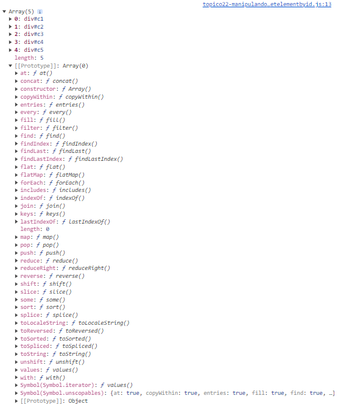
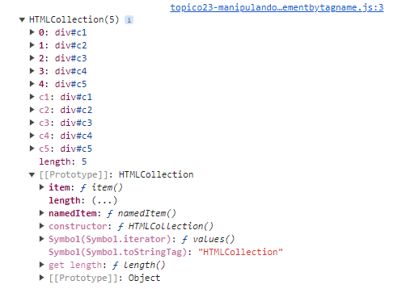
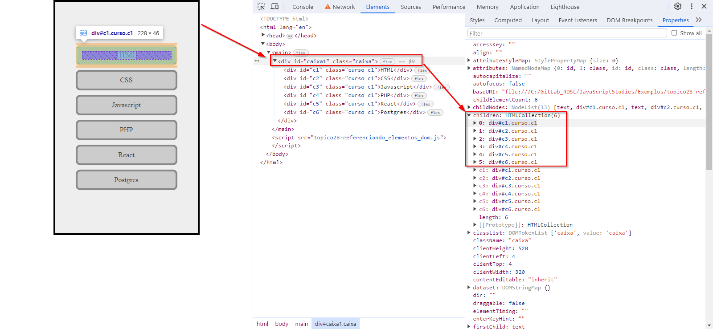
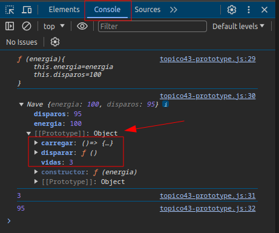

# ESTUDOS SOBRE JAVASCRIPT

Esse documento visa a ser um caderno de estudos sobre javascript.

## ÍNDICE
1. [Instalando o Node.js;](#1-instalando-o-nodejs)
2. [Modo restrito;](#2-modo-restrito)
3. [Declaração de variáveis (let, var const);](#3-declara%C3%A7%C3%A3o-de-vari%C3%A1veis-let-var-const)
4. [Operadores matemáticos;](#4-operadores-matem%C3%A1ticos)
5. [Operadores relacionais;](#5-operadores-relacionais)
6. [Operadores lógicos;](#6-operadores-l%C3%B3gicos)
7. [Operadores bitwise;](#7-operadores-bitwise)
8. [Pré e Pós incremento;](#8-pr%C3%A9-e-p%C3%B3s-incremento)
9. [Operação ternária;](#9-opera%C3%A7%C3%A3o-tern%C3%A1ria)
10. [Typeoff function;](#10-typeoff-function)
11. [Spread function;](#11-spread-function)
12. [Condicional com IF e ELSE;](#12-condicional-com-if-e-else)
13. [Condicional com Switch Case;](#13-condicional-com-switch-case)
14. [Loop com FOR;](#14-loop-com-for)
15. [FOR IN e FOR OF;](#15-varia%C3%A7%C3%B5es-do-loop-for-for-in-e-for-of)
16. [Loop WHILE;](#16-Loop-WHILE)
17. [Loop DO WHILE;](#17-Loop-DO-WHILE)
18. [Declarações CONTINUE e BREAK;](#18-Declarações-CONTINUE-e-BREAK)
19. [Funções;](#19-Funções)
20. [Map method;](#20-Map-method)
21. [Operador THIS;](#21-Operador-THIS)
22. [Manipulando o DOM - getElementsById method;](#22-Manipulando-o-DOM---getElementsById-method)
23. [Manipulando o DOM - getElementsByTagName method;](#23-Manipulando-o-DOM---getElementsByTagName-method)
24. [Manipulando o DOM - getElementsByClassName method;](#24-Manipulando-o-DOM---getElementsByClassName-method)
25. [Manipulando o DOM - querySelector method;](#25-Manipulando-o-DOM---querySelector-method)
26. [Manipulando o DOM - Adicionando eventos com addEventListener method;](#26-Manipulando-o-DOM---Adicionando-eventos-com-addEventListener-method)
27. [Manipulando o DOM - stopPropagation method;](#27-Manipulando-o-DOM---stopPropagation-method)
28. [Entendendo a relação dos elementos no DOM em Javascript;](#28-Entendendo-a-relação-dos-elementos-no-DOM-em-Javascript)
29. [Manipulando o DOM - Criando elementos dinamicamente;](#29-Manipulando-o-DOM---Criando-elementos-dinamicamente)
30. [Manipulando o DOM - Removendo elementos dinamicamente;](#30-Manipulando-o-DOM---Removendo-elementos-dinamicamente)
31. [Filter method;](#31-Filter-method)
32. [Manipulando o DOM - Toggle method;](#32-Manipulando-o-DOM---Toggle-method)
33. [Find method;](#33-Find-method)
34. [Every method;](#34-Every-method)
35. [Some method;](#35-Some-method)
36. [Reduce method;](#36-Reduce-method)
37. [Push method;](#37-Push-method)
38. [Protocolo de Iteração (Iterador);](#38-Protocolo-de-Iteração-Iterador)
39. [Coleções de Dados - Arrays;](#39-Coleções-de-Dados---Arrays)
40. [Coleções de Dados - Map;](#40-Coleções-de-Dados---Map)
41. [Coleções de Dados - Set;](#41-Coleções-de-Dados---Set)
42. [Strings Template;](#42-Strings-Template)
43. [Classes e Objetos;](#43-Classes-e-Objetos)
44. [Conversão de JSON em Objeto Literal e vice-versa;](#44-Conversão-de-JSON-em-Objeto-Literal-e-vice-versa)
45. [Promise;](#45-Promise)
46. [Biblioteca Date;](#46-Biblioteca-Date)
47. [Biblioteca Math;](#47-Biblioteca-Math)
48. [Redirecionamento de páginas e histórico;](#48-Redirecionamento-de-páginas-e-histórico)
49. [Caixas de Diálogo;](#49-Caixas-de-Diálogo)
50. [PDF e Impressão;](#50-PDF-e-Impressão)
51. [Módulos;](#51-Módulos)

---
### 1. Instalando o Node.js;

**Instalação em ambiente Windows:**
1. Acessar o site do [Node.js](https://nodejs.org/en);
2. Baixar a versão LTS mais atualizada;
3. Instalar no computador;

**Instalação em ambiente Linux:**

No ambiente Linux existem algumas formas de se instalar o Node.js. É sugerido a utilização do método via NVM, relacionado no site da [Hostinger](https://www.hostinger.com/tutorials/how-to-install-node-ubuntu).

**Validando a instalação:**

Em ambos os casos, para validar que o Node.js foi instalado com o comando `node -v` no console;

Para executar o código, como por exemplo um "Hello World", devemos criar um arquivo e rodar com o comando node.

- Sintaxe básica:
    ```sh
    node arquivo.js
    ```

> :memo: **Note:** NODE.js é server side, portanto ele não tem acesso aos elementos do DOM. </br> Para se ter acesso aos elementos do DOM, o script deverá ser chamado por uma página HTML dentro do navegador.

#### Exemplos e Referências
- Exemplos em: ./Exemplos/topico1-hello_world.js
- URL de referência: https://youtu.be/E4DBTqgxHGM?si=RpCIPW4Xj8Yg5QEX

---
### 2. Modo restrito;

O modo restrito server para forçar que o dev escreva um código mais simples e mais fortemente tipado.

Para ativar o modo restrito, ou o _strict mode_, no código basta inicializarmos o script com `"use strict"`.

#### Exemplos e Referências
- Exemplos em: ./Exemplos/topico1-hello_world.js
- URL de referência: https://youtu.be/HFOzef8k9GE?si=SfKV9rWqsBDb98YO
- URL de apoio: https://www.w3schools.com/js/js_strict.asp

---
### 3. Declaração de variáveis (let, var const);

No JavaScript temos 3 formas de declarar uma variável, são elas: var, let e const.

1. var
    - Quando declaramos uma variável com `var`, ela será elevada ao maior nível do escopo;
    - Por exemplo, se ela for declarada dentro de uma classe ou função, ela poderá ser utilizada pela classe/função como um todo.
    - Sintaxe básica:
        ```js
        var variável = valor
        ```

2. let
    - Quando declaramos uma variável com `let`, ela será utilizada somente dentro do escopo ou contexto que foi declarada;
    - Por exemplo, se ela for declarada dentro de uma validação, ela será utilizada somente dentro daquela validação e não em toda a função ou classe a qual aquela validação pertence;
    - Sintaxe básica:
        ```js
        let variável = valor
        ```

3. const
    - A declaração de variável usando `const` é semelhante a declaração com `var`, porém ela não poderá sofrer alteração posterior;
    - Comumente é utilizada para instanciar um objeto ou chamar uma função;
    - Sintaxe básica:
        ```js
        const variável = valor
        ```

#### Exemplos e Referências
- Exemplos prático em ./Exemplos/topico3-variaveis.js
- URL de referência: https://youtu.be/zRA8RkDUqH0?si=41z3TICmffqoSdoX
- URL de apoio: https://www.w3schools.com/js/js_variables.asp

---
### 4. Operadores matemáticos;

Os operadores matemáticos ou aritméticos são os operadores para realização de cálculos matemáticos:
1. Soma (`+`)
2. Subtração (`-`)
3. Multiplicação (`*`)
4. Divisão (`/`)
5. Resto ou mod (`%`)

#### Exemplos e Referências
- Exemplos prático em ./Exemplos/topico4-operadores_matematicos.js
- URL de referência: https://youtu.be/eDVUmGnQJ_c?si=suSyU3-whupB6adT
- URL de apoio: 
    - Aritméticos: https://www.w3schools.com/js/js_arithmetic.asp
    - Operadores: https://www.w3schools.com/js/js_operators.asp
    - Atribuição: https://www.w3schools.com/js/js_assignment.asp

---
### 5. Operadores relacionais;

1. Maior que (`>`)
2. Maior ou igual (`>=`)
3. Menor que (`<`)
4. Menor ou igual (`<=`)
5. Igual (`==`)
    - Quando utilizamos somente o '=' ele é reconhecido como uma atribuição e não uma comparação.
6. Estritamente igual (`===`)
    - A diferença entre o '===' e o '==' é que o primeiro valida o valor, tipo e endereço de memória, e o segundo só valida o valor contido na variável.
    - Fica evidente em comparação de tipos de variáveis básicas, quando for comparado json, arrays e outros, ele considera que são itens diferentes. Objetos são considerados endereço de memória.
7. Diferente (`!=`)

O resultado final das operações de comparação (relacionais) é o retorno verdadeiro ou falso (True ou False). Com base nesse retorno é que o código vai continuar a operação.

Vale dizer também que os operadores relacionais são afetados também pelo operador de negação '!'.

#### Exemplos e Referências
- Exemplos prático em ./Exemplos/topico5-operadores_relacionais.js
- URL de referência: https://youtu.be/5ESHpHXFa4M?si=avK4n4iDcSbYdRcE
- URL de apoio: 
    - Operadores: https://www.w3schools.com/js/js_operators.asp
    - Atribuição: https://www.w3schools.com/js/js_assignment.asp

---
### 6. Operadores lógicos;

1. AND (`&&`)
    - Retorna Verdadeiro ou Falso dependendo das condições testadas.
2. OR (`||`)
    - Retorna Verdadeiro ou Falso dependendo das condições testadas;
    - Vale ressaltar que este OU, conforme é visto na tabela verdade, ele é um OU inclusivo, e não exclusivo.
3. NOT (`!`)
    - O NOT inverte o valor do que foi retornado.

**Tabela Verdade**


#### Exemplos e Referências
- Exemplos em: ./Exemplos/topico6-operadores_logicos.js
- URL de referência: https://youtu.be/0-dgk6u9WBE?si=_VH0VJLATnBe4LLu
- URL de apoio: 
    - Operadores: https://www.w3schools.com/js/js_operators.asp
    - Atribuição: https://www.w3schools.com/js/js_assignment.asp

---
### 7. Operadores bitwise;

Também conhecidos como operadores "bit a bit".

1. AND (`&`)
    - Este operador realiza a comparação bit a bit dos valores apresentados, seguindo a mesma regra do operador AND da tabela verdade apresentada nos operadores lógicos.
2. OR (`|`)
    - Este operador realiza a comparação bit a bit dos valores apresentados, seguindo a mesma regra do operador OR da tabela verdade apresentada nos operadores lógicos.
3. XOR (`^`)
    - Este operador realiza a comparação bit a bit dos valores apresentados, seguindo a mesma regra do operador XOR da tabela verdade apresentada nos operadores lógicos.
4. Deslocamento para a esquerda (`<<`)
    - Este operador realiza o deslocamento dos bits para a esquerda;
    - Esta operação faz com que o valor seja dobrado o número de vezes que for declarado;
    - É possível deslocar quantos bits forem necessários.
5. Deslocamento para a direita (`>>`)
    - Este operador realiza o deslocamento dos bits para a direita;
    - Esta operação faz com que o valor seja dividido ao meio o número de vezes que for declarado;
    - É possível deslocar quantos bits forem necessários.

Existe um arquivo excel explicando a lógica dos operadores bitwise em ./Exemplos/operadores_bitwise.xlsx

#### Exemplos e Referências
- Exemplos em: ./Exemplos/topico7-operadores_bitwise.js
- URL de referência: https://youtu.be/JbGf_hd6g_Q?si=qb7BHaJ9nrN3xky-
- URL de apoio: 
    - Operadores: https://www.w3schools.com/js/js_operators.asp
    - Atribuição: https://www.w3schools.com/js/js_assignment.asp
    - Bitwise: https://www.w3schools.com/js/js_bitwise.asp

---
### 8. Incremento, decremento e inversão de valor;

Consideremos os operadores de incremento, ou decremento, como `++` junto a variável. O que definirá se será pré ou pós será a localização do operador a variável.

1. Incremento (`++` ou `+=X`)
    - Vai incrementar 1 ou X na variável.
2. Decremento (`--` ou `-=X`)
    - Vao decrementar 1 ou X na variável.
3. Inversão (`-X`)
    - Assim como na matemática ao multiplicar um número por -1, e o sinal do número é trocado, o mesmo ocorre com o operador de inversão.
4. Pré incremento, ou decremento (`X++` ou `X--`)
    - Neste caso o incremento será realizado antes da operação realizada.
5. Pós incremento, ou decremento (`++X` ou `--X`)
    - Neste caso o incremento será realizado após a operação realizada.

Vale reforçar que as operações de incremento e decremento realmente alteram o valor da variável, e não somente na execução das operações.

Por exemplo, se incrementarmos uma variável que tem valor 10, a variável passará a valer 11.

Obs. Caso tenhamos uma string na operação o operador `+` será considerado um operador de concatenação e não mais um incremento.

Em ambos os casos, fica mais visível com o exemplo prático.

#### Exemplos e Referências
- Exemplos em: ./Exemplos/topico8-pre_pos_incremento.js
- URL de referência: https://youtu.be/lz03-62owNY?si=oN6O3kLb7OKDRv1c
- URL de apoio: 
    - Aritméticos: https://www.w3schools.com/js/js_arithmetic.asp
    - Operadores: https://www.w3schools.com/js/js_operators.asp
    - Atribuição: https://www.w3schools.com/js/js_assignment.asp

---
### 9. Operação ternária;

Também são conhecidos como "IF Ternários" ou "Condições Ternárias".

Ele geralmente é utilizado para simplificar um teste, uma condição.

O símbolo utilizado para realizar a operação ternária é o `?`.

- Sintaxe básica:
    ```js
    (teste lógico ? retorno se verdadeiro : retorno se falso)
    ```

#### Exemplos e Referências
- Exemplos em: ./Exemplos/topico9-operacao_ternaria.js
- URL de referência: https://youtu.be/5JPfbLGqzXA?si=mbl5yAKNS8kxrQer

---
### 10. Typeof function;

Também conhecido como "Operador Unário Typeof".

Ele á uma função nativa do Javascript que retorna o tipo da variável que ele vai testar. Muito semelhante ao `type` do Python.

Em Javascript temos 4 tipos de variáveis, são elas: Number, String, Object e Boolean.

- Sintaxe básica:
    ```js
    let variável = valor
    typeof(variável)
    ```
> :memo: **Note:** A função typeof retorna um valor, portanto para ser exibido, ou ela deverá ser explicitamente, ou o retorno deverá ser inserido em outra variável. 

#### Exemplos e Referências
- Exemplos em: ./Exemplos/topico10-funcao_typeof.js
- URL de referência: https://youtu.be/K2U22waWKGo?si=khIcUPV6sj7NpBTq
- URL de apoio: https://www.w3schools.com/js/js_typeof.asp

---
### 11. Spread function;

Também conhecido como "Operador Spread".

O Spread é realizado utilizando os `...` (3 pontos ou reticências) e ele serve para "quebrar" um array.

Comumente é utilizado para converter HTML collections para um array, possibilitando maior controle sobre os valores dentro do array.

Um dos exemplos que será explicado é caso seja utilizado o spread em objetos iguais, nesse caso, ele considerará o último objeto declarado.

> :memo: **Note:** Os índices de arrays sempre começam com 0. Por exemplo, se tivermos um array de 3 itens, os índices serão 0, 1 e 2.

#### Exemplos e Referências
- Exemplos em: ./Exemplos/topico11-funcao_spread.js
- URL de referência: https://youtu.be/_qgObfmqokw?si=hb_Zn3ibD8l-OgEP
- URL de apoio: https://www.w3schools.com/js/js_array_iteration.asp#mark_spread

---
### 12. Condicional com IF e ELSE;

A validação de condicionais determinará qual fluxo o sistema vai trabalhar. A declaração if/else sempre fará uma validação de condições com o que for passado para ela, caso verdadeiro, executará um bloco de código, caso falso, executará outro bloco de código.

Em geral os testes das condições são utilizando as [operações relacionais](#6-operadores-l%C3%B3gicos) e [operadores lógicos](#6-operadores-l%C3%B3gicos).

**Diagramas de Exemplos**







- A sintaxe padrão do IF/ELSE é desta forma:
    ```js
    if(condição){
        Se verdadeiro, este bloco será executado.
    }else{
        Se falso, este bloco será executado.
    }
    ```

> :memo: **Obs:** Se o IF/ELSE tiverem apenas uma linha de execução, não será necessário a declaração das chaves "{}".

#### Exemplos e Referências
- Exemplos em: ./Exemplos/topico12-validacao_condicoes.js
- URL de referência: https://youtu.be/lDTKpamdXzc?si=rCMrTDnE_hV9IBv_
- URL de apoio: https://www.w3schools.com/js/js_if_else.asp

---
### 13. Condicional com Switch Case;

A utilização do Switch Case para validação das condicionais é semelhante ao do IF/ELSE, onde ele fará a validação da expressão que lhe for passada e encaminhará para os casos que estão declarados nele.

Será passado para o Switch a declaração que será testada e os casos que esta declaração será testada e seus blocos de código.

- A sintaxe padrão do Switch/Case é desta forma:
    ```js
    switch(declaração){
        case teste lógico:
            bloco de código
            break
        case teste lógico:
            bloco de código
            break
        default:
            blóco de código padrão
            break
    }
    ```

**Diagrama de exemplo**


#### Exemplos e Referências
- Exemplos em: ./Exemplos/topico13-switch_case.js
- URL de referência: https://youtu.be/L4dpMM3MVWY?si=P9LFYMIyp3E6hWWo
- URL de apoio: https://www.w3schools.com/js/js_switch.asp

---
### 14. Loop com FOR;

Estruturas de loop são estruturas de repetições. Elas são utilizadas que é necessário a repetição de determinadas ações. Cada repetição é chamada de iteração.

Temos duas classificações de loop, as definidas e indefinidas.

**Definidas:** As estruturas de repetições definidas são utilizadas quando se é conhecido a quantidade de vezes que aquele loop deverá ser executado. Neste caso utiliza-se a estrutura `FOR`.

**Indefinidas:** As estruturas de repetições indefinidas são utilizadas quando não se é conhecido a quantidade de vezes que aquele loop deverá ser executado. Nestes casos pode ser utilizado tanto o `WHILE` quando o `DO WHILE`.

- A sintaxe básica do loop FOR é:
    ```js
    for(inicializador; condição; controle){
        bloco de código que será iterado
    }
    ```

O loop FOR será executado enquanto sua condição for verdadeira, caso ela seja falsa, o loop será interrompido.

> :warning: **Warning:** É necessário se ter cuidado com a validação/condição do loop FOR para que não se tenha um loop infinito.

> :memo: **Obs:** Se o FOR tiver apenas uma linha de execução, não será necessário a declaração das chaves "{}".

#### Exemplos e Referências
- Exemplos em: ./Exemplos/topico14-loop_for.js
- URL de referência: https://youtu.be/qBSB5H7mCGo?si=hNfN1_TBv4NW4DDl
- URL de apoio: https://www.w3schools.com/js/js_loop_for.asp

---
### 15. Variações do loop FOR (FOR IN e FOR OF);

FOR IN e FOR OF são variações do loop FOR.

**FOR IN:** O FOR IN é utilizado para percorrer objetos e arrays de uma forma simplificada. Ele fará a iteração e retornará o índice para o valor definido.

- Sintaxe básica do loop FOR IN:
    ```js
    for(valor in objeto){
        bloco de código que será iterado, onde valor é o índice da iteração.
    }
    ```

**FOR OF:** O FOR OF também é utilizado para percorrer objetos e arrays, contudo ele retorna o valor que está localizado no índice iterado e não o índice em si como o FOR ou o FOR IN.

- Sintaxe básica do loop FOR OF:
    ```js
    for(valor of objeto){
        bloco de código que será iterado, onde valor é o item dentro do objeto.
    }
    ```

Ambos funcionam também para coleções HTML.

#### Exemplos e Referências
- Exemplos em: ./Exemplos/topico15-for_in_for_of.js
- URL de referência: https://youtu.be/WLLCmepsG6Y?si=Xe-AI_yDr18157ZZ
- URLs de apoio:
    - FOR IN: https://www.w3schools.com/js/js_loop_forin.asp
    - FOR OF: https://www.w3schools.com/js/js_loop_forof.asp

---
### 16. Loop WHILE

O loop WHILE é considerado um loop indefinido, pois é utilizado quando não se sabe a quantidade de vezes que ele deverá ser executado.

Ao contrário do loop FOR, e suas variações, o loop WHILE não realiza o incremento de forma automática. Caso seja desejado um loop finito, o incremento até chegar a sua condição deverá ser realizado dentro do bloco de código desejado.

O WHILE realiza o teste lógico e então realiza o bloco de código que está dentro dele.



- A sintaxe básica do loop WHILE é:
    ```js
    while(condição){
        bloco de código que será iterado
    }
    ```

> :warning: **Warning:** É necessário se ter cuidado com incremento ou alteração dos dados da condição do loop WHILE para que não se tenha um loop infinito indesejado.

#### Exemplos e Referências
- Exemplos em: ./Exemplos/topico16-loop_while.js
- URL de referência: https://youtu.be/Nm6vfrLrGs8?si=tEOiqIG9aRUSaYbI
- URL de apoio: https://www.w3schools.com/js/js_loop_while.asp

---
### 17. Loop DO WHILE

O loop DO WHILE também é considerado um loop indefinido, assim como o WHILE, contudo a diferença entre eles é que, o WHILE realiza o teste lógico e então realiza a atividade, já o DO WHILE realiza a atividade e então o teste lógico. Portanto no loop WHILE não se tem a garantia de que o bloco de código será executado ao menos uma vez, já no DO WHILE sim, pois ele será executado e depois o loop fará o teste da condição.

- Sintaxe básica do loop DO WHILE:
    ```js
    do{
        bloco de código que será executado
    }while(condição)
    ```

#### Exemplos e Referências
- Exemplos em: ./Exemplos/topico17-loop_do_while.js
- URL de referência: https://youtu.be/nAS21yLt2-Q?si=v3_XG4KvDsEMhVn5
- URL de apoio: https://www.w3schools.com/js/js_loop_while.asp

---
### 18. Declarações CONTINUE e BREAK

As declarações `continue` e `break` servem de controle para iterações.

**CONTINUE:** Ao encontrar o comando CONTINUE, o loop vai pular somente aquela iteração.

**BREAK:** Ao encontrar o comando BREAK, o loop será interrompido imediatamente.

#### Exemplos e Referências
- Exemplos em: ./Exemplos/topico18-continue_break.js
- URL de referência: https://youtu.be/KRojULEQx24?si=vrMVkrI-_cSsMf6I
- URL de apoio: https://www.w3schools.com/js/js_break.asp

---
### 19. Funções

As funções numa linguagem de programação podem ser entendidas como blocos de código que podem ser utilizados quando necessário e por mais de uma vez.

Quando escrevemos um código, comando a comando, ele será executado do início ao fim, respeitando a ordem e as condições. Quando criamos uma função, esse bloco só será executado caso ele seja requisitado.

**Retorno**

As funções podem retornar valores também, não somente realizar as operações. Neste caso, podemos utilizar o `return` para que seja retornado um valor. 

Funções podem ter apenas <ins>um</ins> `return`. Isto se deve ao fato de sempre que uma função executa o `return` ela é finalizada, e não executará mais nenhuma instrução. 

Para se ter mais de um `return` ou retornar mais de um valor, ou devemos ter uma condicional que direcionará para qual retorno será dado ou o retorno deverá ser um objeto ou array.

**Parâmetros**

Parâmetros são valores que serão passados para a função. Os parâmetros de uma função são opcionais. Os parâmetros podem ter um valor padrão definido na declaração.

Existem duas formas de se declarar parâmetros de uma função:
1. Parâmetros definidos;
    - Neste caso, a quantidade de parâmetros é definida;
    - Necessário a declaração deles na criação da função, podendo ter um valor padrão ou não;
2. Parâmetros REST;
    - Neste caso, a quantidade de parâmetros não é definida;
    - A declaração de parâmetros rest se dá através de um spread de um array, portanto deverão ser manipulados/iterados como um array;

**Tipos de função**

1. Basic function
    - Sintaxe básica:
        ```js
        function função(){ //declaração da função
            bloco de código que será executado
        }

        função() //chamada da função
        ```
    - Sintaxe com parâmetros:
        ```js
        function função(parâmetros=valor padrão){
            bloco de código que será executado
        }

        função(parâmetros)
        ```
    - Sintaxe com parâmetros rest:
        ```js
        function função(...valores){
            bloco de código que será executado
        }

        função(array de valores)
        ```
2. Anonymous function
    - Funções anônimas são funções sem um nome declarado;
    - Elas também não ficam em memória, como as funções normais que aguardam serem chamadas;
    - As funções anônimas são instanciadas em tempo de execução;
    - Como elas não possuem um nome declarado, devem ser declaradas dentro de variáveis;
    - É sugerido que as funções anônimas sejam declaradas como `const` para que elas não sofram alteração durante o funcionamento do código, mas elas podem ser declaradas com `var` ou `let` também;
    - Sintaxe básica:
        ```js
        const variável = function(parâmetros){bloco de código que será executado}
        ```
    - Também podemos ter uma função anônima construtora;
    - Os parâmetros devem ser passados como string;
    - O último parâmetro será o corpo da função, o bloco de código que será executado;
    - Sintaxe construtora:
        ```js
        const variável = new Function("parâmetros", "return bloco de código que será executado") //Obrigatório que seja com F maiúsculo
        ```
3. Arrow function
    - Também conhecidas como funções lambda;
    - Arrow functions também são consideradas como funções anônimas;
    - Caso a arrow function tenha apenas UM parâmetro, ela não precisa estar entre parênteses;
    - A saída padrão de uma arrow function já é o `return`;
    - Caso a arrow function seja simples, com até uma linha, ela não precisa ter o corpo entre chaves;
    - Sintaxe básica:
        ```js
        const variável = (parâmetros)=>{bloco de código que será executado}
        ```
4. Funções aninhadas
    - Funções aninhadas são funções que ficam dentro de funções;
    - São geralmente utilizadas para dar uma organização melhor no código;
5. Funções geradoras
    - Funções geradoras tem seu retorno atrasado até o momento em que é solicitado;
    - Uma função geradora não precisa terminar a execução para gerar um retorno, ela pode ir retornando durante o processamento;
    - Na primeira chamada ela retorna um iterador, e nas demais ela retorna um `yield`;
    - Geralmente utilizadas em situações assíncronas;
    - Sintaxe básica:
        ```js
        function* função(){
            Bloco de código com os retornos realizados por yields
        }
        ```
    - As chamadas geralmente são através de variáveis, e podemos percorrer elas pois são objetos iteráveis;

:bulb: **Tip:** Devido a dificuldade no entendimento, utilizei o chat gpt pra me auxiliar na explicação. A melhor explicação que obtive está em ./ExplicacoesGPT/funcoes_geradoras.md

#### Exemplos e Referências
- Exemplos em: ./Exemplos/topico19-funcoes.js
- URLs de referência:
    - Funções: https://youtu.be/Ig1nVMDLXns?si=DRTIdCTqZ1DGxSW-
    - Retorno: https://youtu.be/vRHQyl_yu5k?si=FTx7DmWdZrnJA9vh
    - Parâmetros: https://youtu.be/hTZ7WJx0de0?si=mJCq05CF0aWs0nlv
    - Parâmetros Rest: https://youtu.be/pZfH_UWg8Ro?si=pYPJVLBEa2d0q-8L
    - Funções anônimas: https://youtu.be/0HJU96mThMg?si=JJ8-xMJP82koB7du
    - Arrow functions: https://youtu.be/maiNY1zYKSQ?si=QJDj3THhoh9DheBW
    - Funções aninhadas: https://youtu.be/SNKIzr9JgtQ?si=7nEIpivWRuCGOPrt
    - Funções geradoras: https://youtu.be/3j9Ikmm2ieA?si=EZpeVrzlUsmcuSJD
- URL de apoio: https://www.w3schools.com/js/js_functions.asp

---
### 20. Map method

O método `map()` é utilizado para percorrer todos os elementos de um array, de uma coleção ou json. Ao contrário de uma iteração que pode percorrer apenas parte de um objeto, o `map()` **obrigatoriamente** vai percorrer todo o objeto.

- Sintaxe completa:
    ```js
    let variável = Array.prototype.map.call(array, (valores)=>{função()})
    ```

- Sintaxe simplificada:
    ```js
    array.map(função)
    ```

    **OBS.:** A sintaxe básica é utilizada quando desejamos passar apenas o valor corrente do método `map` para uma função externa.

- Sintaxe com funções anônimas:
    ```js
    array.map((elemento, índice) => função(elemento, índice))
    ```

A sintaxe com funções anônimas é utilizada quando desejamos passar, além do valor padrão, os outros valores que o método `map()` nos permite, como índice e o próprio array/objeto.

- Parâmetros do método `map()`:

| Parameter | Description |
|-----------|-------------|
| função() | Obrigatório.</br> Uma função que utilizará os elementos. | 
| elemento | Obrigatório.</br> O valor corrente do array. |
| índice | Opcional.</br> O índice do elemento corrente. |
| array | Opcional.</br> O array do elemento corrente. |
| valor_extra | Opcional.</br> O valor padrão é undefined. Um valor passado para a função a ser usado como "este valor". |


#### Exemplos e Referências
- Exemplos em: ./Exemplos/topico20-map_function.js
- URL de referência: https://youtu.be/0M2ba5A6DHY?si=ZHW7GuVPa70OVdOU
- URLs de apoio: 
    - https://www.w3schools.com/jsref/jsref_map.asp
    - https://www.w3schools.com/js/js_array_iteration.asp#mark_map

---
### 21. Operador THIS

O operador `this` é utilizado para referenciar a função a qual ele está.

Ele força uma divisão de contextos. Onde uma função aninhada interna tenha um contexto diferente da função pai.

Para situações onde se é desejado utilizar o contexto externo, internamente, é sugerido a utilização de arrow functions.

O operador `this` é muito similar à utilização do `self` em uma classe Python.

> :bulb: **Tip:** Parte da explicação do funcionamento do `this` está nos comentários dos exemplos.

#### Exemplos e Referências
- Exemplos em: ./Exemplos/topico21-operador_this.js
- URL de referência: https://youtu.be/21U6gqefijo?si=6ekiTwPssYfkp3fh
- URL de apoio: https://www.w3schools.com/js/js_this.asp

---
### 22. Manipulando o DOM - getElementById method

O método `getElementById()` é um método da classe `document` do javascript. Ele retorna o elemento, buscando por seu ID.

Primeiramente deve ficar claro que o NODE.js é o lado servidor do javascript (server side), para situações onde se é desejado manipular o DOM (client side) deve ser utilizado o navegador, por exemplo o google chrome.

Isto se deve ao fato do NODE não ter acesso aos artefatos do lado do cliente. Desta forma, a página HTML em questão que chamará o código javascript para executar ele do lado do cliente.

- Sintaxe básica:
    ```js
    const variavel = document.getElementById("ID")
    ```

#### Exemplos e Referências
- Exemplos em: ./Exemplos/topico22-manipulando_dom_getelementbyid.js
- Outros exemplos podem ser vistos em:
    - ./Exemplos/topico1-hello_world.js
    - ./Exemplos/topico11-funcao_spread.js
    - ./Exemplos/topico15-for_in_for_of.js
    - ./Exemplos/topico19-funcoes.js
    - ./Exemplos/topico20-map_function.js
- URL de referência: https://youtu.be/gtlU0fHvXyk?si=fhi-b8epbUdl9O4t
- URLs de apoio:
    - HTML DOM: https://www.w3schools.com/js/js_htmldom.asp
    - HTML DOM Methods: https://www.w3schools.com/js/js_htmldom_methods.asp
    - HTML DOM Document: https://www.w3schools.com/js/js_htmldom_document.asp
    - HTML DOM Elements: https://www.w3schools.com/js/js_htmldom_elements.asp
    - HTML DOM - Changing HTML: https://www.w3schools.com/js/js_htmldom_html.asp
    - HTML DOM Collections: https://www.w3schools.com/js/js_htmldom_collections.asp
    - HTML DOM Node Lists: https://www.w3schools.com/js/js_htmldom_nodelist.asp

---
### 23. Manipulando o DOM - getElementsByTagName method

Assim como o `getElementsById()`, o `getElementsByTagName()` é um método da classe `document` do javascript para manipulação do DOM.

A diferença entre eles, é quem um traz o elemento em si (`getElementsById()`), já o `getElementsByTagName()` retorna um `HTMLCollection` (coleção de elementos HTML), que se assemelha a um objeto.

- Sintaxe básica:
    ```js
    const variável = document.getElementsByTagName("Nome da Tag")
    ```

> :bulb: **Tip:** Uma das formas de se converter um HTMLCollection para um array é utilizando o [spread function](#11-spread-functon), conforme citado nos exemplos da função.




#### Exemplos e Referências
- Exemplos em: ./Exemplos/topico23-manipulando_dom_getelementbytagname.js
- URL de referência: https://youtu.be/FJrcpHllPB8?si=aBY36wN7_pbHKIK-
- URLs de apoio:
    - HTML DOM: https://www.w3schools.com/js/js_htmldom.asp
    - HTML DOM Methods: https://www.w3schools.com/js/js_htmldom_methods.asp
    - HTML DOM Document: https://www.w3schools.com/js/js_htmldom_document.asp
    - HTML DOM Elements: https://www.w3schools.com/js/js_htmldom_elements.asp
    - HTML DOM - Changing HTML: https://www.w3schools.com/js/js_htmldom_html.asp
    - HTML DOM Collections: https://www.w3schools.com/js/js_htmldom_collections.asp
    - HTML DOM Node Lists: https://www.w3schools.com/js/js_htmldom_nodelist.asp

---
### 24. Manipulando o DOM - getElementsByClassName method

Assim como o `getElementById()` e `getElementsByTagName()`m o `getElementsByClassName()` é um método da classe `document` do javascript para manipulação do DOM.

O método `getElementsByClassName()` assim como o `getElementsByTagName()`, também retorna um HTMLCollection.

- Sintaxe básica:
    ```js
    const variavel = document.getElementsByClassName("Nome da Classe")
    ```

#### Exemplos e Referências
- Exemplos em: ./Exemplos/topico24-manipulando_dom_getelementbyclassname.js
- URL de referência: https://youtu.be/g578TMgdi_U?si=jZUVIhJm2EGbDk-0
- URLs de apoio:
    - HTML DOM: https://www.w3schools.com/js/js_htmldom.asp
    - HTML DOM Methods: https://www.w3schools.com/js/js_htmldom_methods.asp
    - HTML DOM Document: https://www.w3schools.com/js/js_htmldom_document.asp
    - HTML DOM Elements: https://www.w3schools.com/js/js_htmldom_elements.asp
    - HTML DOM - Changing HTML: https://www.w3schools.com/js/js_htmldom_html.asp
    - HTML DOM Collections: https://www.w3schools.com/js/js_htmldom_collections.asp
    - HTML DOM Node Lists: https://www.w3schools.com/js/js_htmldom_nodelist.asp

---
### 25. Manipulando o DOM - querySelector method

Tanto o `querySelector()` quanto o `querySelectorAll()` são métodos da classe `document` do javascript para manipulação do DOM.

A diferença deles para os anteriores, é que eles são versáteis nas buscas que eles realizam.

- **querySelector:** Retorna o primeiro elemento respeitando a query realizada.
- Sintaxe básica:
    ```js
    const variável = document.querySelector(filtro)
    ```

- **querySelectorAll:** Retorna um objeto do tipo `NodeList`, que é muito similar ao `HTMLCollection`, só que num padrão mais antigo.
    - O `querySelectorAll()` permite que sejam declarados mais de um filtro; 
        - Os filtros podem ser combinados de três formas:
            - Filtro **ou** Filtro;
            - Filtro **e** Filtro;
            - Filtro **dentro de** Filtro;
    - Para realizar a busca pelo nome da tag, assim como no getElementsByTagName, devemos escrever apenas o 'nome_da_tag';
    - Para realizar a busca pelo nome da classe, assim como no getElementsByClassName, devemos escrever '.nome_da_classe';
    - Para realizar a busca pelo id, assim como no getElementById, devemos escrever '#id';
    - Sintaxe básica:
        ```js
        const variável = document.querySelectorAll(filtro)
        ```

#### Exemplos e Referências
- Exemplos em: ./Exemplos/topico25-manipulando_dom_queryselector.js
- URL de referência: https://youtu.be/2V7rfcVg5UQ?si=zyHBCrPHnL8aHZ-b
- URLs de apoio:
    - HTML DOM: https://www.w3schools.com/js/js_htmldom.asp
    - HTML DOM Methods: https://www.w3schools.com/js/js_htmldom_methods.asp
    - HTML DOM Document: https://www.w3schools.com/js/js_htmldom_document.asp
    - HTML DOM Elements: https://www.w3schools.com/js/js_htmldom_elements.asp
    - HTML DOM - Changing HTML: https://www.w3schools.com/js/js_htmldom_html.asp
    - HTML DOM Collections: https://www.w3schools.com/js/js_htmldom_collections.asp
    - HTML DOM Node Lists: https://www.w3schools.com/js/js_htmldom_nodelist.asp

---
### 26. Manipulando o DOM - Adicionando eventos com addEventListener method

Existem duas formas de se trabalhar com eventos entre o HTML e o javascript, uma seria trabalhar com o evento dentro da tag HTML e a outra seria trabalhar com o evento dentro do script javascript.

Utilizando o `addEventListener()` ele cria um "escutador" de eventos vindos do DOM para o script javascript.

O retorno do método `addEventListener()` é um objeto `PointerEvent`, onde todos os dados daquele evento estão declarados.

- Sintaxe básica:
    ```js
    elemento.addEventListener("Evento", Função)
    ```

> :memo: **Note:** É sugerido que sempre se utilize os eventos pelo lado do javascript e não no HTML para se manter uma página limpa.

#### Exemplos e Referências
- Exemplos em:
    - Apresentação do módulo: ./Exemplos/topico26-manipulando_dom_addeventlistener.js
    - Exercício prático: ./Exemplos/topico26-copiando_elementos.js
- URLs de referência: 
    - Apresentação do módulo: https://youtu.be/4vCBmu3z5FY?si=BNqEvbdA3kqnwOtV
    - Exercício prático p1: https://youtu.be/aanyXzOaic8?si=JHrQDuPBoYMCMPdB
    - Exercício prático p2: https://youtu.be/94KKNdx42lM?si=PikjKacoOmWA31BQ
- URLs de apoio:
    - HTML DOM Events: https://www.w3schools.com/js/js_htmldom_events.asp
    - HTML DOM EventListener: https://www.w3schools.com/js/js_htmldom_eventlistener.asp

---
### 27. Manipulando o DOM - stopPropagation method

Existem situações onde o evento é declarado em um elemento do DOM que contém outros elementos. Neste tipo de caso, o evento é propagado para os elementos filhos.

Para que não haja essa propagação, deve ser utilizado o método `stopPropagation()`.

- Sintaxe básica:
    ```js
    elemento.stopPropagation()
    ```

#### Exemplos e Referências
- Exemplos em: ./Exemplos/topico27-manipulando_dom_stoppropagation.js
- URL de referência: https://youtu.be/7NcRhRN4MAw?si=iXymeMAEDFvGfq8A
- URLs de apoio:
    - HTML DOM Events: https://www.w3schools.com/js/js_htmldom_events.asp
    - HTML DOM EventListener: https://www.w3schools.com/js/js_htmldom_eventlistener.asp

---
### 28. Entendendo a relação dos elementos no DOM em Javascript

**Estrutura básica de um HTML**
```
HTML (Pai/ROOT)
|_ HEAD (Filho)
    |_ TITLE (Neto)
|_ BODY (Filho)
    |_ DIV (Neto)
    |_ DIV (Neto)
    |_ DIV (Neto)
    |_ SCRIPT (Neto)
```

Desta mesma forma podemos fazer o seguinte paralelo para explicar o funcionamento e hereditariedade das DIVs.

```
DIV (Parent/Root)
|_ DIV (First Child)
|_ DIV (Child/Siblings)
|_ DIV (Child/Siblings)
|_ DIV (Child/Siblings)
|_ DIV (Last Child)
```

Portanto temos 3 tipos de relação:
- Relação parent, quando um elemento é pai de outro;
- Relação child, quando um elemento é filho de outro;
- Relação sibling, quando um elemento é irmão de outro. Em outras palavras, são os elementos que estão dentro de um mesmo pai;
    - Vale ressaltar que um elemento child de um outro elemento, não tem relação com os siblings do elemento pai;

Uma forma de observar essa relação no navegador é desta forma:


Podemos observar as relações através dos campos: _childNodes_, _children_, _firstChild_, _firstElementChild_, _lastChild_, _lastElementChild_, _nextElementSibling_, _nextSibling_, _previousSibling_, _parentElement_ e _parentNode_ por exemplo.

Uma das formas que temos para verificar se um determinado elemento possuí filhos, é a utilização do método `hasChildNodes`. Este método retornará `true` ou `false` se o elemento tiver ou não filhos. 

- Sintaxe básica:
    ```js
    elemento.hasChildNodes()
    ```

Vale ressaltar que o texto do elemento é considerado como filho, portanto dependendo da abordagem que se deseja utilizar, será mais interessante fazer uma validação pelo `length` dos `children`.

Também é possível navegar pelos nós, através de sua relação entre eles, como por exemplo, chamando o pai do elemento desejado, ou seu avô, e nada impede que seja acessado um outro nó filho do pai.

#### Exemplos e Referências
- Exemplos em: ./Exemplos/topico28-referenciando_elementos_dom.js
- URLs de referência: 
    - https://youtu.be/HOLoqv3meTI?si=HATjsofqPQWs7zsk
    - https://youtu.be/woT9kGbzJU4?si=1zPzkX0bj0yAssVO
    - https://youtu.be/KzXZMemQ_Lc?si=KkX8yrD6qwm5qfK1
- URLs de apoio:
    - HTML DOM: https://www.w3schools.com/js/js_htmldom.asp
    - HTML DOM Navigation: https://www.w3schools.com/js/js_htmldom_navigation.asp
    - HTML DOM Elements (Nodes): https://www.w3schools.com/js/js_htmldom_nodes.asp

---
### 29. Manipulando o DOM - Criando elementos dinamicamente

O javascript permite a manipulação do DOM, inclusive criação e manipulação de elementos dinamicamente. Os métodos e atributos mais utilizados, para isto, são `createElement()`, `innerHTML`, `value`, `setAttribute()`, `appendChild()` e `insertBefore()`. Onde:

- **createElement**: Método para criação do elemento em memória;
    - Sintaxe básica:
        ```js
        const novo_elemento = document.createElement("tipo do elemento")
        ```
    - A criação do elemento é através de uma variável, então pode ser utilizada a declaração de variável desejada ou que melhor se ajuste ao caso.

- **innerHTML**: Atributo que contém o texto do elemento;
    - Sintaxe básica:
        ```js
        novo_elemento.innerHTML = "Texto do elemento"
        ```

- **value**: Atributo que contém o texto do element do tipo input;
    - Sintaxe básica:
        ```js
        novo_elemento.value
        ```

- **setAttribute**: Método que define um atributo e seu valor;
    - Sintaxe básica:
        ```js
        novo_elemento.setAttribute("atributo","valor do atributo")
        ```

- **appendChild**: Método que adiciona o elemento no elemento pai;
    - Sintaxe básica:
        ```js
        elemento_pai.appendChild(novo_elemento)
        ```

- **insertBefore**: Método que insere o elemento antes do elemento informado;
    - Sintaxe básica:
        ```js
        elemento_pai.insertBefore(novo_elemento, elemento_informado)
        ```

#### Exemplos e Referências
- Exemplos em: ./Exemplos/topico29-manipulando_dom_criando_elementos.js
- URL de referência: 
    - Criando elementos dinamicamente: https://youtu.be/KzXZMemQ_Lc?si=ZMoRrWDqOJwchl-r
    - Criando elementos antes: https://youtu.be/41MaPviOS5Y?si=sVDmOi6YVl2WL0iD
- URL de apoio:
    - HTML DOM Elements (Nodes): https://www.w3schools.com/js/js_htmldom_nodes.asp

---
### 30. Manipulando o DOM - Removendo elementos dinamicamente

Com a manipulação do DOM realizada pelo javascript, também é possível realizar a remoção de itens dinamicamente. Para isto, utiliza-se o comando `removeChild()`, onde ele irá remover o nó filho informado.

- Sintaxe básica:
    ```js
    elemento.removeChild(elemento filho)
    ```

Vale ressaltar, que como elemento filho, pode-se declarar a relação do elemento, portanto pode ser declarado o nó pai.

Já o método `remove()` é utilizado, ao contrário do `removeChild()`, para remover o elemento em si.

- Sintaxe básica:
    ```js
    elemento.remove()
    ```

#### Exemplos e Referências
- Exemplos em: 
    - ./Exemplos/topico30-manipulando_dom_removendo_elementos.js
    - ./Exemplos/topico31p2-exemplo_filter_method.js
- URLs de referência: 
    - removeChild: https://youtu.be/Rx1AbTkK-kc?si=DKX2nUAM9Rmh4Xk7
    - remove: https://youtu.be/eEc8O8JKtWo?si=ti9_efi-EQ2ejfeE
- URL de apoio:
    - HTML DOM Elements (Nodes): https://www.w3schools.com/js/js_htmldom_nodes.asp

---
### 31. Filter method

O método `filter()` de um array, possibilita iterar um array e retornar os valores desejados.

A forma de iterar é semelhante ao método `map()`, contudo ele é otimizado para realização de filtros.

Nos exemplos, há um mostrando a diferença entre eles.

- Sinaxe básica:
    ```js
    array.filter(função)
    ```
    - array é o elemento que será filtrado;
    - filter é o método;
    - função é onde estará a lógica de filtragem, podendo ser uma função anônima declarada dentro do método ou uma função externa;

O método filter passa 3 parâmetros ordenados: o elemento do array, índice do elemento do array e o array propriamente dito.

#### Exemplos e Referências
- Exemplos em: 
    - ./Exemplos/topico31-filter_method.js
    - ./Exemplos/topico31p2-exemplo_filter_method.js
- URLs de referência: 
    - https://youtu.be/r2lw77tFd8o?si=Zh4FAY4hfT_F9E_8
    - https://youtu.be/ks3uaFS-idQ?si=MTqvZkD4tJWrR8hT
- URL de apoio: https://www.w3schools.com/js/js_array_iteration.asp#mark_filter

---
### 32. Manipulando o DOM - Toggle method

Assim como o método `add()` e o `remove()`, o método `toggle()` é um método do `classList`, que por sua ves é uma propriedade dos elementos do DOM.

- **add**: Utilizado para adicionar uma classe a lista de classes do elemento.
    - Sintaxe básica:
        ```js
        elemento.classList.add(classe)
        ```

- **remove**: Utilizado para remover uma classe a lista de classes do elemento.
    - Sintaxe básica:
        ```js
        elemento.classList.remove(classe)
        ```

- **toggle**: Utilizado para adicionar/remover uma classe da listagem de classes do elemento.
    - Sintaxe básica:
        ```js
        elemento.classList.toggle(classe)
        ```

#### Exemplos e Referências
- Exemplos em: 
    - ./Exemplos/topico32-manipulando_dom_toggle_method.js
    - ./Exemplos/topico26-manipulando_dom_addeventlistener.js
- URLs de referência: https://youtu.be/Z3sp3xK04P0?si=7b_PuBnXB-9bsQoz
- URL de apoio: https://www.w3schools.com/jsref/prop_element_classlist.asp

---
### 33. Find method

O método `find()` pesquisa elementos dentro de um array, e retorna o primeiro elemento encontrado. Caso algum elemento seja encontrado, ele retorna como true e o valor do elemento, caso seja falso, ele retorna como undefined.

Ao contrário dos métodos `filter()` e `map()`, o `find()` retorna se o termo pesquisado foi encontrado ou não, seu valor e seu índice.

- Sintaxe básica:
    ```js
    array.find(função)
    ```

#### Exemplos e Referências
- Exemplos em: ./Exemplos/topico33-find_method.js
- URLs de referência: https://youtu.be/bEovepaalZA?si=TUGY0rbaNyroqR3L
- URL de apoio: https://www.w3schools.com/jsref/jsref_find.asp

---
### 34. Every method

O `every()` é um método de manipulação de arrays. Ele verifica se um array respeita a regra passada para ele, retornando true para caso todo o array respeite o teste lógico, e retornando false para caso haja um elemento fora da regra.

Similar a outros métodos de manipulação de array, ele trabalha com o elemento, índice e o array em si.

Caso haja algum elemento no array que não respeite o filtro aplicado, ele pode retornar o índice da primeira ocorrência que não respeita o filtro.

A diferença entre a utilização do `every()` e do `map()`, é que o `every()` vai parar após encontrar o primeiro elemento falso, já o `map()` vai retornar um array contendo o teste lógico em cima de cada elemento do array originário.

- Sintaxe básica:
    ```js
    array.every(função)
    ```

#### Exemplos e Referências
- Exemplos em: ./Exemplos/topico34-every_method.js
- URLs de referência: https://youtu.be/XzcOiyl40zk?si=ODDtbYeHwdd7gs-c
- URL de apoio: https://www.w3schools.com/jsref/jsref_every.asp

---
### 35. Some method

Muito similar ao método `every()`, o método `some()` realiza a validação do array, contudo ele retornará `true` caso algum elemento coincida com o filtro aplicado. Caso, nenhum elemento coincida com o filtro, ele retornará `false` e o íncide do último elemento, pois ele percorreu todo o array.

- Sintaxe básica:
    ```js
    array.some(função)
    ```

#### Exemplos e Referências
- Exemplos em: ./Exemplos/topico34-every_method.js
- URLs de referência: https://youtu.be/TGHleqCYXF4?si=vlUJep2-WKo-6rkV
- URL de apoio: https://www.w3schools.com/jsref/jsref_some.asp

---
### 36. Reduce method

O `reduce()` é um método de array, onde ele vai iterar o array, assim como os outros métodos, contudo ele tem um parâmetro a mais que é o "valor anterior", onde ele armazena a resposta da última iteração.

- Sintaxe básica:
    ```js
    array.reduce(função)
    ```

#### Exemplos e Referências
- Exemplos em: ./Exemplos/topico36-reduce_method.js
- URLs de referência: https://youtu.be/LfKJFLqQgGo?si=BMGamsn0IfoIlr1g
- URL de apoio: https://www.w3schools.com/jsref/jsref_reduce.asp

---
### 37. Push method

O `push()` é um método de array, onde é adicionado um valor ao final do array.

- Sintaxe básica:
    ```js
    array.push(valor)
    ```

- Exemplo básico:
    ```js
    let _array=[]
    _array.push(1)
    _array.push(2)
    // [1,2]
    ```
> :memo: **Note:** Foi utilizado _array e não array, pois array é uma palavra protegida de javascript.

#### Exemplos e Referências
- Exemplos em: ./Exemplos/topico36-reduce_method.js
- URLs de referência: 
- URL de apoio: https://www.w3schools.com/jsref/jsref_push.asp

---
### 38. Protocolo de Iteração (Iterador)

O protocolo de iteração define como produzir uma sequência de valores de um objeto. Um objeto se torna iterável quando implementado o método `next()`.

Iteradores são aplicáveis em coleções, como array, strings, maps, sets, etc...

Um iterador Javascript é um objeto que tenha a função `Symbol.iterator`, que retorna a função `next()`.

O método `next()` deve retornar um objeto com duas propriedades:

> `value` (o próximo valor)
> `done` (`true` ou `false`)

|||
|---|---|
| value | O valor retornado pelo iterador (pode ser omitido quanto `done` for `true`) |
| done | `true` se o iterador tiver terminado, se ele já tiver chegado ao final da coleção, `false` se o iterador retornou um novo valor |

#### Exemplos e Referências
- Exemplos em: ./Exemplos/topico38-iteracao.js
- URLs de referência: https://youtu.be/2oHEGBx1HR8?si=in9jBOOMoZDE3Xl3
- URL de apoio: https://www.w3schools.com/js/js_object_iterables.asp

---
### 39. Coleções de Dados - Arrays

Arrays são os tipos mais simples de coleção em Javascript e eles podem receber todos os tipos de dados (strings, numbers, arrays, objetos, funções) dentro deles. Também são chamados de vetores, ou em casos onde um array está contido em outro array, podem ser chamados de matrizes.

Arrays são objetos iteráveis, e que possuem diversos métodos como `map()`, `filter()`, `reduce()`, etc...

Como são iteráveis, eles possuem índice para definir a posição dos itens. Os índices sempre serão iniciados com 0 (zero), portanto o item de índice [0] é o primeiro elemento, o elemento de índice [1] é o segundo elemento e por aí vai.

- Exemplo:

| | | | | |
|:---:|:---:|:---:|:---:|:---:|
|0|1|2|3|4|
|"leo"|"lucia"|"isis"|"hera"|"apolo"|

Os arrays no Javascript podem ser comparados com as listas do Python.

- Sintaxe básica:
    ```js
    const array=[itens]
    ```

#### Exemplos e Referências
- Exemplos em: 
    - Exemplo teórico: ./Exemplos/topico39-Arrays.js
    - Exemplo prático: ./ExemplosRW/topico39-calculadora.js
- URLs de referência: 
    - Inicial: https://youtu.be/err29ahFES4?si=kgGisQij_2Ot8ruU
    - Exercício: https://youtu.be/IzADtpBafSQ?si=R_SHekfNEUsWlPQi
- URL de apoio: 
    - https://www.w3schools.com/js/js_arrays.asp
    - https://www.w3schools.com/jsref/jsref_obj_array.asp

---
### 40. Coleções de Dados - Map

A coleção map é uma coleção de chaves e valores, faz lembrar os dicionários do Python.

Diferente dos arrays, que utilizam índice para serem iteráveis e terem seus valores retornados, o Map utiliza a chave para fazer a indexação, portanto não é possível ter chaves iguais (pode haver valores iguais sem problemas). Caso uma chave seja passada e ela já exista, ela terá seu valor atualizado.

As chaves e valores do Map podem ser de qualquer tipo, e também podem armazenar funções.

Os elementos do Map não podem ser passados no construtor.

|**Método** | **Descrição** |
|---|---|
| new Map() | Cria uma nova coleção Map |
| set() | Define um valor para uma chave num Map |
| get() | Exibe um valor para uma chave num Map |
| delete() | Remove um elemento da coleção pela chave |
| has() | Retorna `true` se o elemento existe no Map |
| forEach() | Chama uma função para cada par chave/valor do Map |
| entries() | Retorna um iterador com o par chave/valor no Map |
| keys() | Retorna as chaves de um Map |
| values() | Retorna os valores de um Map |
| clear() | Apaga toda a coleção |
| **Propriedade** | **Descrição** |
| size | Retorna o número de elementos do Map |

- Sintaxe básica:
    ```js
    const variável = new Map()
    ```

#### Exemplos e Referências
- Exemplos em: ./Exemplos/topico40-Maps.js
- URLs de referência: https://youtu.be/y9Tz0bjXBXs?si=eqIj3GdArwVq641a
- URL de apoio: 
    - https://www.w3schools.com/js/js_maps.asp
    - https://www.w3schools.com/js/js_object_maps.asp

---
### 41. Coleções de Dados - Set

O Set é uma coleção que recebe um array, porém diferente do array, ele não aceita valores duplicados, ela aceitará somente a primeira ocorrência do valor passado.

O Set diferentemente do Map pode já ter os valores passados em seu construtor.

|**Método** | **Descrição** |
|---|---|
| new Set() | Cria uma nova coleção Set |
| add() | Adiciona um valor para uma chave num Set |
| delete() | Remove um elemento da coleção |
| has() | Retorna `true` se o elemento existe no Set |
| forEach() | Chama uma função para cada elemento do Set |
| values() | Retorna um iterador com o elemento no Set |
| clear() | Apaga toda a coleção |
| **Propriedade** | **Descrição** |
| size | Retorna o número de elementos do Set |

- Sintaxe básica:
    ```js
    const variável = new Set()
    ```

#### Exemplos e Referências
- Exemplos em: ./Exemplos/topico41-Sets.js
- URLs de referência: https://youtu.be/v24QAyoiAo0?si=6yLanVHvN24C27WB
- URL de apoio: 
    - https://www.w3schools.com/js/js_sets.asp
    - https://www.w3schools.com/js/js_object_sets.asp

---
### 42. Strings Template

O string template é uma forma de concatenação de strings, muito similar ao `fstrings` do python.

A sua declaração é utilizando crases "`" e as variáveis são declaradas com uma notação similar a do shellscript "${}".

Essa forma de declaração de strings também permite strings com múltiplas linhas.

- Sintaxe básica:
    ```js
    const variável = `Texto da variável ${variável_concatenada}`
    ```


#### Exemplos e Referências
- Exemplos em: ./Exemplos/topico42-strings_template.js
- URLs de referência: https://youtu.be/R2PvSZU5xLY?si=Q9IABrJZvgEwD4nw
- URL de apoio: https://www.w3schools.com/js/js_string_templates.asp

---
### 43. Classes e Objetos

Em Javascript objetos podem ser variáveis ou objetos literais (tipo json) ou instâncias de classes.

#### Classes

- **Classe**: Uma classe é como um plano ou modelo para criar objetos. Ela define as propriedades e comportamentos que os objetos desse tipo terão. É como um conjunto de instruções sobre como construir algo.

- **Objeto**: Um objeto é uma instância concreta de uma classe. É uma entidade que possui características (propriedades) e ações (métodos) definidas pela classe à qual pertence. Em termos simples, um objeto é algo real que é criado com base nas especificações da classe.

Por exemplo, imagine que você tem uma classe chamada "Cachorro". Esta classe define que um cachorro tem propriedades como "nome", "idade" e métodos como "latir" e "andar". Quando você cria um objeto a partir dessa classe, como "meuCachorro" ou "seuCachorro", você está criando instâncias individuais de cachorros que têm suas próprias características específicas, mas seguem o modelo definido pela classe "Cachorro".

**Atributos:** Também conhecidos como propriedades ou campos, os atributos são as características ou dados que um objeto possui. Eles representam o estado do objeto e são usados para descrever suas características. Por exemplo, se tivermos uma classe "Carro", os atributos podem incluir coisas como "marca", "modelo", "ano", "cor", etc. Esses atributos são variáveis que armazenam informações específicas de cada objeto.

A classe pode ter atributos que não são declarados no construtor, porém caso o sejam, serão substituídos pelo do construtor.

**Métodos:** Os métodos são funções definidas na classe que representam o comportamento dos objetos dessa classe. Eles permitem que os objetos executem ações e manipulem seus dados. Por exemplo, a classe "Carro" pode ter métodos como "ligar", "desligar", "acelerar", "frear", etc. Esses métodos definem o que um objeto da classe Carro pode fazer.

- Sintaxe básica:
    ```js
    class Nome_da_Classe{
        constructor(){
            this.variável = valor
        }
    }

    let instancia_objeto = new Nome_da_Classe()
    ```

- Sintaxe como função:
    ```js
    const Nome_da_Classe=function(valor){
        this.variável = valor
    }

    let instancia_objeto = new Nome_da_Classe()
    ```

> :memo: **Note:** O parêntesis da instanciação do objeto é o que será passado para o método construtor. 

Existe também uma forma de trabalhar com classes que seria através de funções, neste caso, a passagem de parâmetros seria na criação da função, e os atributos e parâmetros seriam declarados com `this`, no caso dos métodos, é feita a declaração com funções anônimas.

Para separação dos métodos, neste formato de função, se faz necessário a utilização de ";".

- Sintaxe básica:
    ```js
    function Nome_da_Classe(parâmetros){
        this.atributo=parâmetro,
        this.método=function(){
            "corpo do método"
        }
    }
    ```

**Herança:** é quando uma classe herda os atributos e propriedades de uma classe já existente. Por exemplo, uma classe carro terá os atributos e métodos básicos de todos os carros, e uma classe esportivo, herdando de carro, terá todos os atributos/métodos da classe pai carro e mais os seus próprios atributos/métodos.

- Sintaxe básica de herança:
    ```js
    class NomeDaClasse extends NomeDoPai{
        constructor("atributos do pai/filho"){
            super("atributos do pai")
        }
    }
    ```

**Static:** `static` é uma palavra reservada que define que o atributo ou o método será da classe e não do objeto. Neste caso, o atributo ou método só poderá ser chamado pela própria classe, e não por uma instância da classe.

**Prototype:** É uma forma de se incluir um atributo ou método a uma classe, depois de declarada ou até mesmo instanciada.


*Atributo e métodos adicionados com o prototype.*

- Sintaxe básica:
    ```js
    classe.prototype.atributo = valor
    classe.prototype.método = function(){
        "Corpo do novo método"
    }
    ```

> :memo: **Note:** Para inclusão de métodos, só funcionará com a declaração `function` e não com uma `arrow function`.

**Polimorfismo:** é quando um método de uma classe filha é implementado diferente do método da classe pai.

Por exemplo, considere a classe pai "Animal" e suas subclasses "Cachorro" e "Gato". A classe "Animal" pode ter um método chamado "fazerSom()", e as subclasses "Cachorro" e "Gato" podem sobrescrever esse método com implementações diferentes.

Então, enquanto a classe "Animal" pode ter uma implementação genérica de "fazerSom()" que imprime "Som de animal", a classe "Cachorro" pode sobrescrever esse método para imprimir "Au au!" e a classe "Gato" pode sobrescrevê-lo para imprimir "Miau!".

**Abstract:** Uma classe abstrata é uma classe que não pode ser instanciada diretamente. Em vez disso, ela serve como um modelo para outras classes que estendem ou herdam dela. Uma classe abstrata pode conter métodos e propriedades que são compartilhados por suas subclasses, mas ela própria não. Em vez disso, ela define uma estrutura ou contrato que suas subclasses devem seguir.

Em Javascript não se tem uma forma nativa de se declarar uma classe abstrata, contudo existe uma forma de forçar que a classe não seja instanciada, servido apenas para ser herdada/estendida pelas classes filhas.

- Sintaxe de exemplo de classe abstrata:
    ```js
    class NomeClasse{
        constructor(){
            if(this.constructor===NomeClasse){
                throw new TypeError("Mensagem de exceção")
            }
            this.atributo=valor
            this.atributo="valor"
        }
    }
    ```
    Desta forma a classe abstrata não poderá ser instanciada, somente herdada.

Também é possível fazer que seja obrigatória a implementação de um método ou atributo em uma classe que herda ou estende nossa classe "abstrata".

- Sintaxe de exemplo obrigatoriedade de implementação de método:
    ```js
    class NomeClasse{
        constructor(){
            if(this.constructor===NomeClasse){
                throw new TypeError("Mensagem de exceção")
            }
            if(this.método===undefined){
                throw new TypeError("Mensagem de exceção")
            }
            this.atributo=valor
            this.atributo="valor"
        }
    }
    ```
    Desta forma, todas as classes que herdam desta classe abstrata, serão obrigadas a implementar o método obrigatório.

Ambos os exemplos citados anteriormente foram implementados nos exemplos de polimorfismo.

#### Literal

Diferentemente dos objetos criados pelas classes, onde um objeto é uma instância da classe em memória, possibilitando ter vários objetos distintos, os objetos literais são apontamentos do mesmo endereço de memória. É o objeto em si que é criado e manipulado, e não uma classe como visto anteriormente.

- Sintaxe básica:
    ```js
    objeto = {
        atributo:valor,
        atributo:"valor",
        método:function(){
            "corpo do método"
        },
        método:function(parâmetro){
            "corpo do método"
        }
    }
    ```

> :memo: **Note:** A atribuição de valores nos objetos literais são através de ":" e não "=".

Ao contrário da classe, os métodos dentro de um objeto literal não retornam ele em si, portanto, ou deve ser declarado em seus métodos esse retorno ou o objeto deverá ser retornado posterior a utilização de algum de seus métodos.

Os objetos literais nos possibilitam a criação de tipos de objetos, em outras palavras, podemos criar um objeto padrão e referenciar ele na criação dos demais objetos literais, como se fossemos "instanciar" um objeto com base em outro.

Para Javascript, qualquer tipo de dados que contém a notação de {chaves} será considerado um objeto.

#### Exemplos e Referências
- Exemplos em: 
    - Classes:      ./Exemplos/topico43-objetos_classes.js
    - Literais:     ./Exemplos/topico43-objetos_literais.js
    - Herança:      ./Exemplos/topico43-heranca.js
    - Exemplo:      ./Exemplos/topico43-exemplo.js
    - Static:       ./Exemplos/topico43-static.js
    - Prototype:    ./Exemplos/topico43-prototype.js
    - Polimorfismo: ./Exemplos/topico43-polimorfismo.js
- URLs de referência: 
    - https://youtu.be/h8HvEPIOQ1k?si=_PrfyYv_L-nWZodu
    - https://youtu.be/Y8KBN1NN6tU?si=3CC7KINw4n-VTEUi
    - https://youtu.be/LJBS2qaG08U?si=IQc7r7GE60oFjK-V
    - https://youtu.be/OoyPZMrz7GY?si=g7hgIEpxFe58S9yW
    - https://youtu.be/YLokpJmtvRw?si=5n7M_7NJd_UtMYV0
    - https://youtu.be/-fOCg39SBzc?si=7DZxBRxPs7aztExT
    - https://youtu.be/-85DzYOfoRw?si=gF41y3FQKyJyqB2d
    - https://youtu.be/KXE0-UeHcJI?si=0NMVlpEpI_tGdE-M
    - https://youtu.be/lJ35mX0t1eE?si=zIEIT76rqFChJSvp
    - https://youtu.be/xwqvmRXodC0?si=bH-8udB6-m5fU3uF
    - https://youtu.be/c2t7m3Whyb4?si=hI3Bn4Po00lhBhho
    - https://youtu.be/x_TVjjm6cNM?si=IntfHXc8SCpBrsmL
    - https://youtu.be/Z7w-TZ5mnE4?si=lW6zeg6nQD3eUNXb
- URLs de apoio: 
    - https://www.w3schools.com/js/js_objects.asp
    - https://www.w3schools.com/jsref/jsref_obj_object.asp
    - https://www.w3schools.com/js/js_classes.asp
    - https://www.w3schools.com/jsref/jsref_classes.asp
    - https://www.w3schools.com/jsref/jsref_class_extends.asp
    - https://www.w3schools.com/jsref/jsref_class_static.asp
    - https://www.w3schools.com/jsref/jsref_class_super.asp
    - https://www.w3schools.com/jsref/jsref_constructor_class.asp
    - https://www.w3schools.com/js/js_object_definition.asp
    - https://www.w3schools.com/js/js_object_properties.asp
    - https://www.w3schools.com/js/js_object_methods.asp
    - https://www.w3schools.com/js/js_object_constructors.asp
    - https://www.w3schools.com/js/js_object_prototypes.asp
    - https://www.w3schools.com/js/js_object_display.asp
    - https://www.w3schools.com/js/js_class_inheritance.asp
    - https://www.w3schools.com/js/js_class_static.asp
    - https://www.w3schools.com/jsref/jsref_object_constructor.asp
    - https://www.w3schools.com/jsref/jsref_object_prototype.asp


---
### 44. Conversão de JSON em Objeto Literal e vice-versa

JSON é uma sigla para **J**ava**S**cript **O**bject **N**otation, traduzindo, seria Notação de Objeto de JavaScript.

JSON é considerado uma string, e muito utilizado para comunicação entre aplicações.

Para realizar a conversão, é utilizada uma classe de mesmo nome, chamada `JSON`, que possui dois métodos: `stringify()` e `parse()`.

O método `stringify()` realiza a conversão do objeto em string json e `parse()` realiza a conversão de uma string json em objeto literal.

- Sintaxe básica:
    ```js
    JSON.stringfy(objeto_literal)
    JSON.parse(string_json)

    ```

#### Exemplos e Referências
- Exemplos em: ./Exemplos/topico44-conversaoJsonObjetoLiteral.js
- URLs de referência: https://youtu.be/-EF_SYy2h7Q?si=cBoa1hQF5Ia8LQmW
- URL de apoio: 
    - https://www.w3schools.com/js/js_json.asp
    - https://www.w3schools.com/js/js_json_intro.asp
    - https://www.w3schools.com/jsref/jsref_obj_json.asp

---
### 45. Promise

*"EU PROMETO UMA RESPOSTA!"*

O Javascript executa as linhas de código sequencialmente, não aguardando o retorno delas, contudo existem situações onde é necessário aguardar o retorno da função chamada ou de ações externas, como uma operação em arquivos, consumir uma API, uma atividade de outra aplicação, dentre outros. Nestes casos, pode-se ser utilizado `Promises`, onde será criada uma "promessa" de um retorno.

Uma `Promise` pode ser dividida em duas etapas:
- **Código produtor** é o trecho de código que vai realizar a atividade "demorada";
- **Código consumidor** é o trecho de código que vai aguardar a atividade "demorada";

- Sintaxe básica (CFB):
    ```js
    //Código Produtor
    instancia = new Promise(function(resolve,reject){
        if(condição){
            resolve("o que será retornado em caso de sucesso")
        }else{
            reject("o que será retornado em caso de falha")
        }
    })

    //Código Consumidor
    instancia.then((retorno)=>{
        "código em caso de retorno com sucesso da promise"
    })
    instancia.catch((retorno)=>{
        "código em caso de retorno com falha da promise"
    })
    ```

- Sintaxe básica (W3Schools):
    ```js
    let myPromise = new Promise(function(myResolve, myReject) {
    // "Producing Code" (May take some time)

    myResolve(); // when successful
    myReject();  // when error
    });

    // "Consuming Code" (Must wait for a fulfilled Promise)
    myPromise.then(
    function(value) { /* code if successful */ },
    function(error) { /* code if some error */ }
    );
    ```
    *Quando o consumidor obter o resultado, ele dev e chamar uma das duas funções de callback declaradas.*
    
    |Quando|Chamada|
    |---|---|
    |Sucesso|myResolve(result value)|
    |Falha|myReject(error object)|

#### Propriedades de um objeto Promise

O objeto `Promise` suporta duas propriedades: **estado** e **resultado**.
- Enquanto a `Promise` for "pending" (trabalhando), o resultado é `undefined`.
- Quando a `Promise` for "fulfilled", o resultado será um valor.
- Quando a `Promise` for "rejected", o resultado será um objeto de erro.

|Estado|Descrição|Resultado|
|---|---|---|
|"pending"|estado inicial|`undefined`|
|"fulfilled"|operação completa|o valor do resultado|
|"rejected"|operação falhou|um objeto erro|

> :warning: **Warning:** Não é possível acessar o estado nem o resultado da Promise, somente utilizando seus métodos de manipulação.

#### Funções de callback

Uma coisa importante para trabalhar com `Promise` é saber o que são funções de callback.

Em JavaScript, uma função de callback é simplesmente uma função que é passada como argumento para outra função. Essa função de callback é então chamada dentro da função principal em um momento específico ou quando uma determinada condição é atendida.

Por exemplo, considere a função setTimeout(). Ela é usada para agendar uma chamada de função para ser executada após um certo período de tempo. Aqui está um exemplo de como você poderia usá-la com uma função de callback:

```js
function minhaCallback() {
    console.log("A função de callback foi chamada após 2 segundos.");
}

setTimeout(minhaCallback, 2000); // Chama minhaCallback após 2000 milissegundos (2 segundos)
```
*Neste exemplo, minhaCallback é a função de callback passada como argumento para setTimeout(). Após 2 segundos, minhaCallback será chamada.*

#### Exemplos e Referências
- Exemplos em: ./Exemplos/topico45-promise.js
- URLs de referência: 
    - https://youtu.be/1ZiDrKMZnws?si=sKs4EWGXtv3DGoOA
    - https://youtu.be/JLROo9PVhCw?si=N2f7OcP8iZtJjfEh
- URL de apoio: 
    - https://www.w3schools.com/js/js_promise.asp
    - https://www.w3schools.com/jsref/jsref_obj_promise.asp

---
### 46. Biblioteca Date

A manipulação de data e hora no Javascript se da pela lib/classe Date().

Os objetos data são estáticos, e não em movimento como um relógio. Eles são como uma "foto" daquele momento do relógio.

Um exemplo de objeto data seria:

```
Mon Mar 25 2024 05:30:38 GMT-0300 (Horário Padrão de Brasília)
```

#### Exemplos e Referências
- Exemplos em: ./ExemplosRW/Alarme/alarme.js
- URLs de referência: 
    - https://youtu.be/KHq_RO_8Qb0?si=uBRBQJT7dCEUEL0c
    - https://youtu.be/32yZvWcA1pI?si=PqT_NIvF_S4H1D-3
    - https://youtu.be/HLZxacX8wyg?si=RkzIOAUEee_lruBa
- URL de apoio: 
    - https://www.w3schools.com/jsref/jsref_obj_date.asp
    - https://www.w3schools.com/js/js_dates.asp
    - https://www.w3schools.com/js/js_date_formats.asp
    - https://www.w3schools.com/js/js_date_methods.asp
    - https://www.w3schools.com/js/js_date_methods_set.asp
    - Conversor de epoch - https://www.epochconverter.com/
    - https://pt.wikipedia.org/wiki/Era_Unix

---
### 47. Biblioteca Math

A biblioteca Math permite a execução de tarefas matemáticas.

Math não é uma classe construtora, portanto seus métodos e atributos deverão ser acessados diretamente por ela, sem instanciar ela.

#### Exemplos e Referências
- Exemplos em: ./Exemplos/topico47-math.js
- URLs de referência: 
    - https://youtu.be/oSXBD3g3TeM?si=8sSoseiyx5VkKckH
    - https://youtu.be/uXLXfU2qZ0E?si=tW-K3-zXgrKhPqhj
- URL de apoio: 
    - https://www.w3schools.com/js/js_math.asp
    - https://www.w3schools.com/jsref/jsref_obj_math.asp

---
### 48. Redirecionamento de páginas e histórico

Utilizando as classes `location` e `history` é possível redirecionar URLs e navegar pelo histórico do navegador.

**Exemplos e Referências**
- Exemplos em: ./Exemplos/topico48-redirecionamento-historico.js
- URLs de referência: https://youtu.be/aAdw_U7uTyE?si=A4hK5JB1mM-4ICWJ
- URL de apoio: 
    - https://www.w3schools.com/js/js_window_location.asp
    - https://www.w3schools.com/jsref/obj_location.asp
    - https://www.w3schools.com/js/js_window_history.asp
    - https://www.w3schools.com/jsref/obj_history.asp

---
### 49. Caixas de Diálogo

Nativamente, temos 3 tipos de caixas de diálogo em javascript: `alert()`, `confirm()` e `prompt()`.

**Alerta**

Uma caixa de alerta geralmente é usada para passar algum tipo de informação ao usuário. 

Quando for exibida o usuário deverá pressionar "OK" para prosseguir.

- Sintaxe básica:
    ```js
    alert("Mensagem")
    ```

**Confirmação**

Uma caixa de confirmação geralmente é usada quando se deseja que o usuário verifique ou aceite alguma coisa. 

Quando ela é exibida, o usuário poderá clicar em "OK" ou "Cancel" para prosseguir. Caso seja pressionado "OK" ela retornará `true`, se clicar em "Cancel" ela retornará `false`.

Como ela retorna um `boolean`, a saída dela pode ser inserida em variáveis, ou utilizar diretamente ela.

- Sintaxe básica:
    ```js
    confirm("Mensagem")
    ```

**Prompt**

Uma caixa do tipo prompt geralmente é usada quando se deseja que o usuário insira alguma informação.

Quando exibida, será exibido um campo para o usuário preencher e um botão de "OK" e "Cancel" para que o usuário prossiga. Caso seja pressionado o "OK" o valor dela será retornado, caso seja pressionado o "Cancel" será retornado o valor `null`.

- Sintaxe básica:
    ```js
    prompt("Mensagem","Resposta Padrão Opcional")
    ```

**Exemplos e Referências**
- Exemplos em: ./Exemplos/topico49-caixas_dialogo.js
- URLs de referência: https://youtu.be/56eMlh3glW0?si=G_y2iV3KuHBmmXJ4
- URL de apoio: 
    - https://www.w3schools.com/js/js_popup.asp
    - https://www.w3schools.com/jsref/met_win_alert.asp
    - https://www.w3schools.com/jsref/met_win_confirm.asp
    - https://www.w3schools.com/jsref/met_win_prompt.asp

---
### 50. PDF e Impressão

No exemplo, veremos uma abordagem de como realizar a impressão de documentos de uma forma limpa, não sendo apenas um print da tela do navegador.

**Exemplos e Referências**
- Exemplos em: ./Exemplos/topico50-impressao.js
- URLs de referência: https://youtu.be/z8CSuoFX7Ko?si=BNv9wnFQ7wAa8RKn
- URL de apoio: 

---
### 51. Módulos


**Exemplos e Referências**
- Exemplos em: ./
- URLs de referência: https://youtu.be/z3ZfhL6bDJc?si=IEgTT8nRx4Jw4GYI
- URL de apoio: 